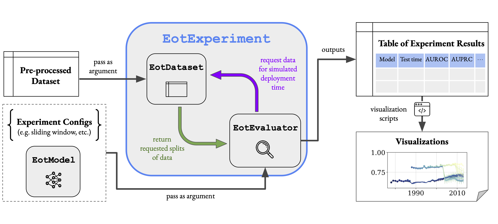

# Evaluating Model Performance in Medical Datasets Over Time (EMDOT)

Model evaluation which takes time into account is [far from standard](https://docs.google.com/spreadsheets/d/1hrR7JZzvQWv4Up5PaKzVxxnGPANs5hHqG4ShErhkG2U/edit?usp=sharing) in research on machine learning for healthcare.

This repository is the official implementation of the EMDOT evaluation framework described in _[Evaluating Model Performance in Medical Datasets Over Time](https://proceedings.mlr.press/v209/zhou23a.html)_. 

Citation:
```
@InProceedings{pmlr-v209-zhou23a,
  title = 	 {Evaluating Model Performance in Medical Datasets Over Time},
  author =       {Zhou, Helen and Chen, Yuwen and Lipton, Zachary},
  booktitle = 	 {Proceedings of the Conference on Health, Inference, and Learning},
  pages = 	 {498--508},
  year = 	 {2023},
  editor = 	 {Mortazavi, Bobak J. and Sarker, Tasmie and Beam, Andrew and Ho, Joyce C.},
  volume = 	 {209},
  series = 	 {Proceedings of Machine Learning Research},
  month = 	 {22 Jun--24 Jun},
  publisher =    {PMLR},
  pdf = 	 {https://proceedings.mlr.press/v209/zhou23a/zhou23a.pdf},
  url = 	 {https://proceedings.mlr.press/v209/zhou23a.html},
  abstract = 	 {Machine learning (ML) models deployed in healthcare systems must face data drawn from continually evolving environments. However,  researchers proposing  such models typically evaluate them in a time-agnostic manner, splitting datasets  according to patients sampled randomly  throughout the entire study time period.  This work proposes the Evaluation on Medical Datasets Over Time (EMDOT) framework,  which evaluates the performance of a model class across time.  Inspired by the concept of backtesting,  EMDOT simulates possible training procedures that practitioners  might have been able to execute at each point in time and evaluates the resulting models on all future time points.  Evaluating both linear and more complex models on six distinct medical data sources (tabular and imaging), we % show how depending on the dataset,  using all historical data may be ideal in many cases,  whereas using a window of the most recent data could be advantageous in others.  In datasets  % where models suffer from sudden degradations in performance, we investigate plausible explanations for these shocks. We release the EMDOT package to help facilitate  further works in deployment-oriented evaluation over time.}
}
```

### Installation

First, create a conda environment:

```
conda create --name <env_name> python==3.8.3
conda activate <env_name>
```

Then, install the `emdot` package:

```
git clone https://github.com/acmi-lab/EvaluationOverTime.git
cd EvaluationOverTime/src
pip install .
```

### Quickstart

Below is a code snippet demonstrating how to use this package. For a more complete introduction, **please see [tutorial.ipynb](tutorial.ipynb)**. To view documentation, simply run `help(...)` on the class or object of interest.

```
from emdot.eot_experiment import EotExperiment
from emdot.example_datasets import get_toy_breast_cancer_data
from emdot.models.LR import LR
from emdot.models.GBDT import GBDT
import os
import numpy as np
import pandas as pd
import matplotlib.pyplot as plt
from emdot.utils import plot_metric_vs_time

## First, specify model parameters and experiment.

model_name = 'LR'
model_class = LR
hyperparam_grid = {"C": [10.0**e for e in np.arange(-2, 5)], "max_iter": [500]}

seed_list = [1, 2, 3]

dataset_name = 'toy_data'
label = 'target'
training_regime = 'sliding_window'
df, col_dict = get_toy_breast_cancer_data()

experiment = EotExperiment(
    dataset_name = dataset_name,
    df = df, 
    col_dict = col_dict, 
    label = label,
    model_class = model_class,
    model_name = model_name,
    hyperparam_grid = hyperparam_grid,
    training_regime = training_regime,
    initial_train_window = (0, 4),
    train_end = 7,
    test_end = 9,
    train_prop = 0.5,
    val_prop = 0.25,
    test_prop = 0.25,
    window_length = 5,
    time_unit = 'Year',
    model_folder = './model_info')

## Next, run the experiment.
result_df, model_info = experiment.run_experiment(seed_list, eval_metric="auc")
```

### Inner workings

Below is a diagram of how the `emdot` package works under the hood:



